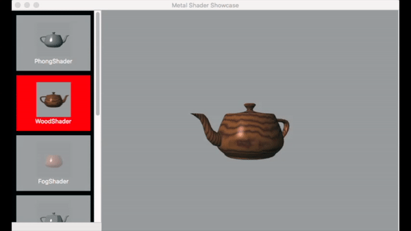

This is the macOS port of Apple's MetalShaderShowcase project. Refer to the README.md file for a description of the original project. 

The project can be compiled with Xcode 7.x running on macOS 10.11.x. The deployment target is set at 10.11.

Since the original project was iOS-based, changes to the interface were necessary. Some source files were removed and others were added. 

Given below is a breakdown of the modifications.
1) The UI consists of a collection view and a custom sub-class of NSView named AAPLView. The original source code of AAPLView was modified so that it could be instantiated correctly on macOS.

2) An IB file MSSColllectionViewItem.xib used in instantiation of the 7 collection view items was added.

3) Added a source file MSSViewController with methods that

	a) provide a CVDisplayLink object to drive the rendering process,
	b) load the various assets used by the demo,
	c) configure the NSCollectionView object,
	d) populate the collection view with 7 collection view items.
	e) indicate the selected collection view item,
	f) instantiate an AAPLRender object to demonstrate the selected shader.

4) Some statements are added to the methods used to instantiate Metal Texture objects from texture descriptors.

5) The window has a minimum content size. Constraints are added to the NSCollectionView and NSView widgets in IB. The width of the NSCollectionView is fixed so that when the window resized its horizontal width will not changed. The adjacent AAPLView to its right can be resized by dragging the edges/corners of the window.

Notes: 
The port implements the old way of rendering using a CVDisplayLink object even though the MTKView class is available on macOS 10.11 or later.

The collection view does not support deletion/insertion/moving of collection view items. Dragging items from Finder is not supported.

Implemented some of the NSCollectionViewDelegate protocol methods; however these are not called by NSCollectionView methods since no collection view items are deleted/inserted/moved. This demo calls the implemented method collectionView:didSelectItemsAtIndexPaths: directly to change the background of the selected collection view item to red. An instance variable  “_lastCVItem” is defined to ensure the previously selected collection view item is unhighlighted.
